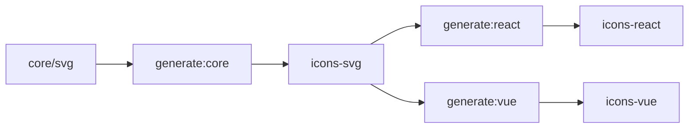

<h1 align="center">Sensoro Design Icons</h1>

<div align="center">

语义化矢量图形库，提供了描述图标的抽象节点来满足对各种框架的适配。

<br />

[![NPM version][npm-image]][npm-url] 
[![NPM downloads][download-image]][download-url]
</div>

## ✨ 特性

- 📦 内置了丰富的图标资源
- 🎉 支持对 React、Vue、React Native、Angular 各种框架的适配
- 💻 使用 TypeScript 开发，提供完整的类型定义文件

## 🏗 安装

请按照自己的框架安装对应的包

```sh
# npm install

# 核心库
npm install @colelab/icons-svg --save
# React
npm install @colelab/icons-react --save

# yarn install

# 核心库
npm add @colelab/icons-svg
# React
npm add @colelab/icons-react

# pnpm install

# 核心库
pnpm i @colelab/icons-svg
# React
pnpm i @colelab/icons-react
```

## 🤝 参与共建

本仓库使用 [pnpm](https://pnpm.io/zh) 进行依赖管理，开发前请保证已安装

```sh
$ git clone git@github.com:sensoro-design/sensoro-design-icons.git
$ cd sensoro-design-icons
$ pnpm generate
$ pnpm build
$ pnpm start
```

[npm-image]: https://img.shields.io/npm/v/@colelab/icons-react.svg?style=flat-square
[npm-url]: https://npmjs.org/package/@colelab/icons-react
[download-image]: https://img.shields.io/npm/dm/@colelab/icons-react.svg?style=flat-square
[download-url]: https://npmjs.org/package/@colelab/icons-react

## Development Environment Note

The docs site (`pnpm start` -> `dumi dev`) currently depends on legacy transitive packages that are incompatible with newer Node runtimes (e.g. Node 24 `http_parser` removal).

Recommended local runtime for docs development in this repo:

```bash
nvm use 20
pnpm start
```

This is repository-specific and does not affect your global Node default.


## Generate / Build Strategy

Documentation build:

```bash
pnpm site:react
pnpm site:vue
pnpm site
```


For consistency across packages, prefer full pipeline:

```bash
pnpm generate
pnpm build
```

Selective commands are also available:

```bash
pnpm generate:core
pnpm generate:react
pnpm generate:vue

pnpm build:core
pnpm build:react
pnpm build:vue
```

Recommendation: when SVG source (`packages/core/svg`) changes, run full generate/build to keep React and Vue outputs in sync.


## Architecture (Core Logic)

This repository uses a layered generation architecture:

1. `@colelab/icons-svg` is the single source of truth (SVG -> ASN).
2. `@colelab/icons-react` and `@colelab/icons-vue` are generated adapter layers.
3. `pnpm generate` synchronizes outputs across core/react/vue to keep API and visuals aligned.

This design enables maintainability, consistency, and tree-shaking-friendly package outputs.



